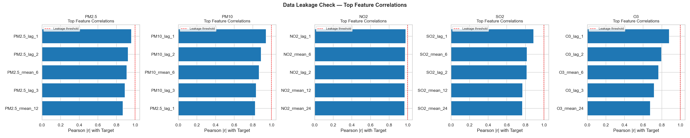
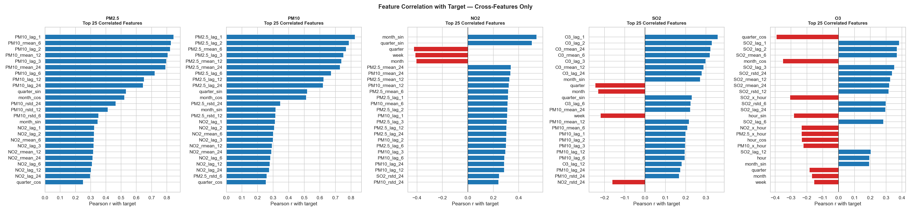
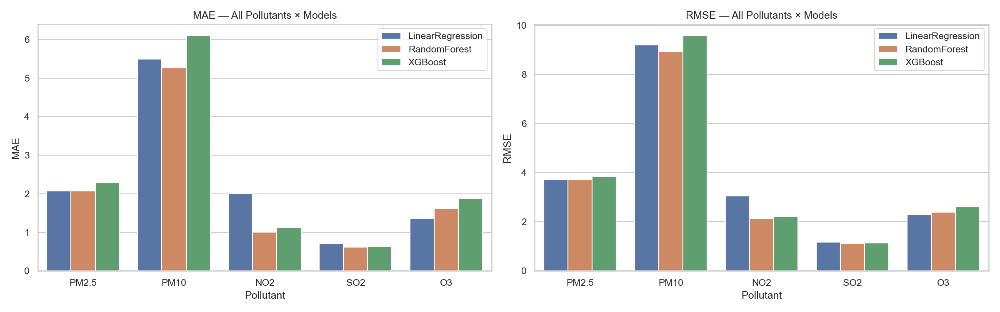
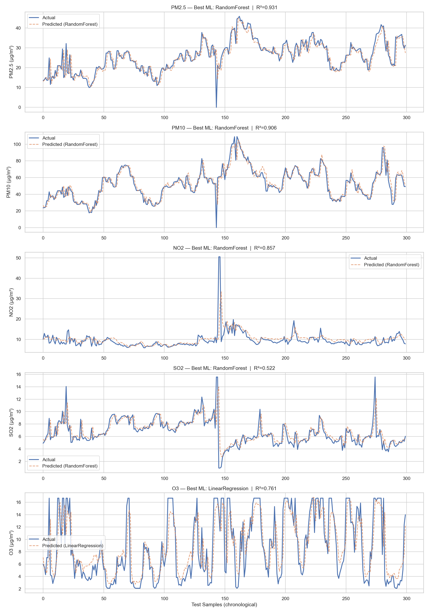
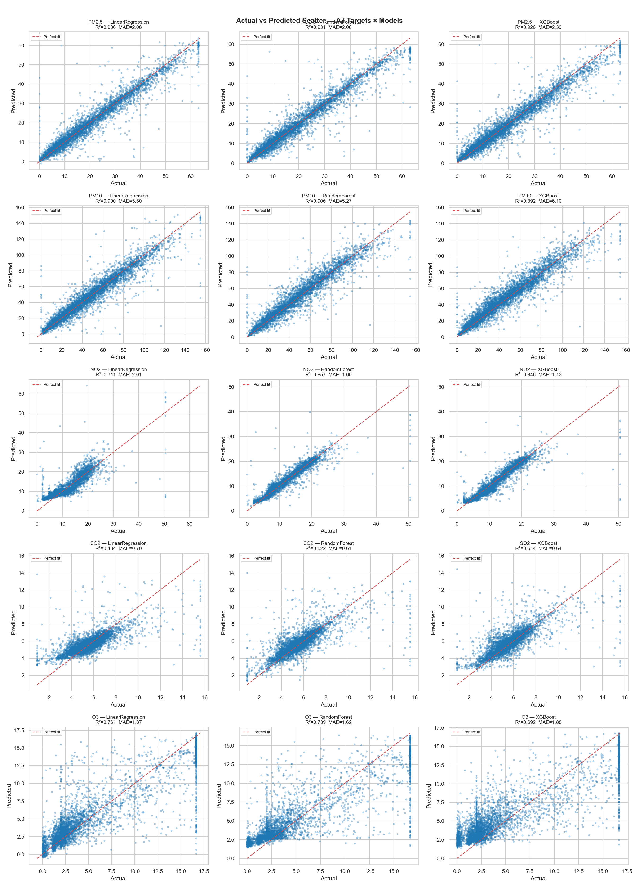
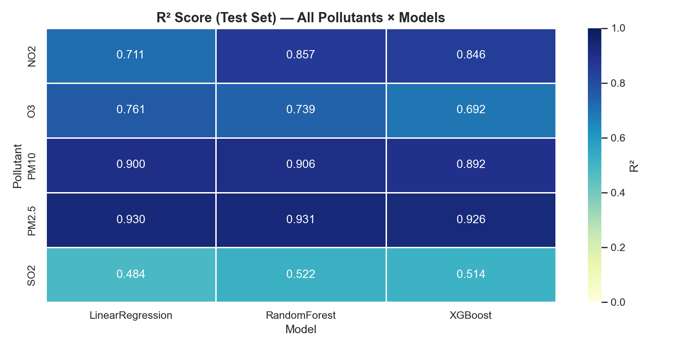
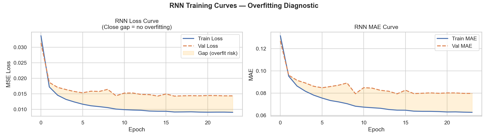
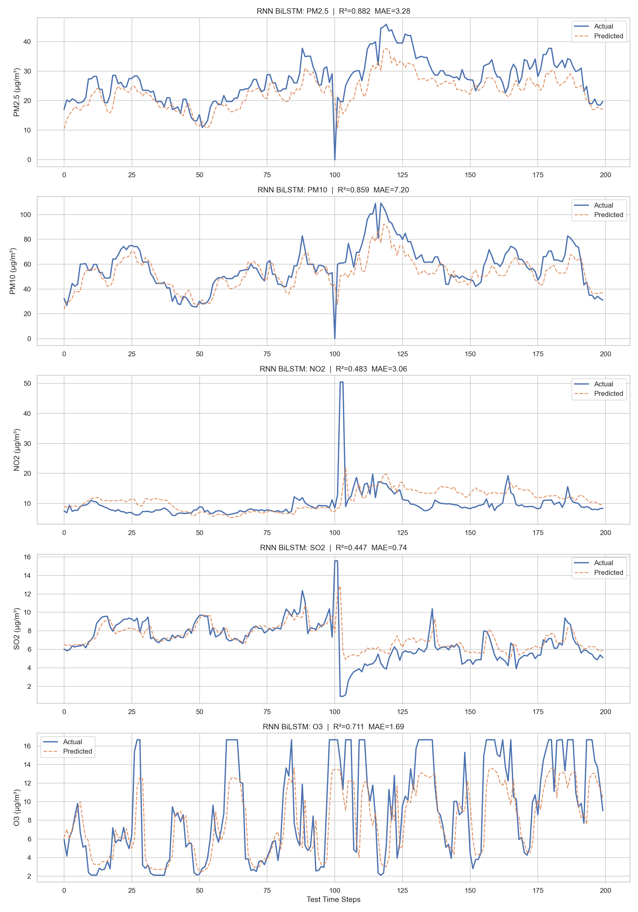
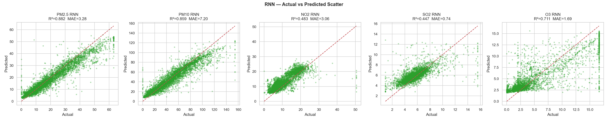

# Air Quality Prediction Using Machine Learning and Bidirectional LSTM (RNN)

## Project Overview

Air pollution is one of the most significant environmental challenges affecting human health and climate. Accurate prediction of air pollutant concentrations can help governments, industries, and environmental agencies take preventive actions and improve air quality management.

This project develops a comprehensive Air Quality Prediction System using both traditional Machine Learning algorithms and Deep Learning techniques. The study compares the performance of multiple predictive models and evaluates their effectiveness in forecasting air pollutant concentrations.

---

## Objectives

* Analyze air quality data and identify important environmental factors.
* Perform data preprocessing and feature engineering.
* Build Machine Learning models for pollutant prediction.
* Develop a Deep Learning Bidirectional LSTM (BiLSTM) model for time-series forecasting.
* Compare the performance of different approaches using standard evaluation metrics.
* Visualize model performance and prediction accuracy.

---

## Dataset Description

The dataset contains air quality measurements collected from environmental monitoring stations of Chhattisgarh.

### Target Pollutants

* PM2.5
* PM10
* NO₂ (Nitrogen Dioxide)
* SO₂ (Sulfur Dioxide)
* O₃ (Ozone)

### Features Used

* Historical pollutant concentrations
* Environmental indicators
* Time-series observations
* Additional engineered features derived during preprocessing

---

## Project Workflow

### 1. Data Collection

* Imported air quality monitoring data.
* Verified data consistency and structure.

### 2. Data Preprocessing

* Missing value handling
* Duplicate record removal
* Feature scaling and normalization
* Data transformation
* Train-test split

### 3. Exploratory Data Analysis (EDA)

* Correlation analysis
* Feature relationship visualization
* Distribution analysis
* Leakage detection checks
* Statistical summaries

### 4. Machine Learning Models

The following Machine Learning algorithms were implemented:

#### Linear Regression

Used as a baseline model for comparison.

#### Random Forest Regression

An ensemble learning technique capable of capturing non-linear relationships.

#### XGBoost Regression

A gradient boosting algorithm known for high predictive performance and efficiency.

### 5. Deep Learning Model

#### Bidirectional Long Short-Term Memory (BiLSTM)

The Bidirectional LSTM model processes information in both forward and backward directions, allowing it to capture temporal dependencies more effectively than traditional recurrent neural networks.

Advantages:

* Learns long-term dependencies
* Captures sequential patterns
* Suitable for time-series forecasting
* Improved prediction accuracy

---

## Technologies Used

### Programming Language

* Python

### Libraries and Frameworks

* Pandas
* NumPy
* Matplotlib
* Seaborn
* Scikit-Learn
* TensorFlow
* Keras
* XGBoost

### Development Environment

* Jupyter Notebook

---

## Evaluation Metrics

The models were evaluated using:

### Mean Absolute Error (MAE)

Measures average prediction error.

### Root Mean Squared Error (RMSE)

Penalizes larger prediction errors.

### R² Score

Measures the proportion of variance explained by the model.

---

## Results and Visualizations

### Data Leakage Analysis



### Feature Correlation Analysis



### Machine Learning Performance Metrics



### Machine Learning Actual vs Predicted Values



### Machine Learning Scatter Plot



### R² Score Heatmap



### BiLSTM Training Curve



### BiLSTM Actual vs Predicted Values



### BiLSTM Scatter Plot



---

## Key Contributions

* Performed end-to-end air quality data analysis.
* Implemented multiple Machine Learning algorithms.
* Developed a Bidirectional LSTM Deep Learning model.
* Compared traditional ML and Deep Learning approaches.
* Generated visual insights through data analysis and model evaluation.
* Demonstrated time-series forecasting for environmental monitoring.

---

## Future Scope

* Real-time AQI prediction system
* IoT sensor integration
* Weather data incorporation
* Deployment using Flask or Streamlit
* Interactive web dashboard
* Cloud-based model deployment

---

## Project Structure

```text
Air-Quality-Prediction-Using-Machine-Learning-and-BiLSTM
│
├── Air_Quality_Prediction_BiLSTM.ipynb
├── Project_Report.pdf
├── README.md
│
└── images
    ├── leakage_check.png
    ├── ml_actual_vs_predicted.png
    ├── ml_feature_correlation_nontarget.png
    ├── ml_mae_rmse.png
    ├── ml_r2_heatmap.png
    ├── ml_scatter_actual_vs_pred.png
    ├── rnn_actual_vs_predicted.png
    ├── rnn_scatter.png
    └── rnn_training_curve.png
```

---

## Authors

* Aditya Goyal
* Srishti Tripathi
* Palak Vastrakar

---

## License

This project is developed for academic and educational purposes.
